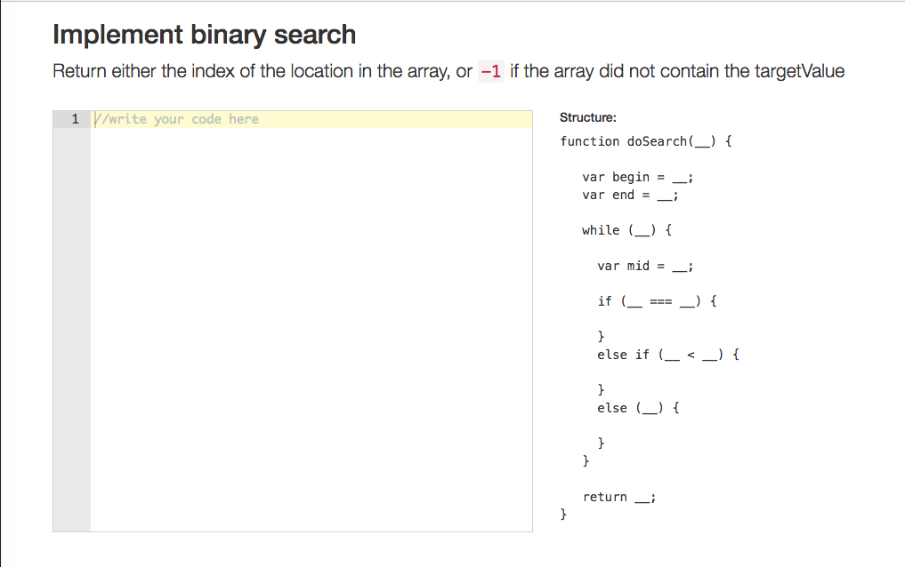

# js-testing-api-3
A static code analysis tool to ensure users enter correct syntax to javascript code challenges.

###Screenshots###

###Getting Started###

	npm install
    bower install

###To Start Server###

    npm start

Go to:

    http://localhost:8080

###To Run Unit Tests###

    npm test

###To Conduct Functional Tests###

Test the Structure:

1. Type 'function test(a) { }' quickly, without stopping
2. Stop typing for 1 second
3. Verify error appears above editor: 'MUST have 2 parameters e.g. function test(a,b)'
4. Add a second parameter to what you just typed e.g., 'function test(a,b) { }'
5. Verify error disappears

Test Whitelist Functionality:

1. Type 'function test(a,b) { if(true) {} }' quickly, without stopping
2. Stop typing for 1 second
3. Verify error appears above editor: 'MUST use WHILE loop inside function block'
4. Add a While loop inside function block e.g., 'function test(a,b) { if(true) { } while(true) { } }'
5. Verify error disappears

Test Blacklist Functionality:

1. Type 'function test(a,b) { while(true) { } while(true) { } }' quickly, without stopping
2. Stop typing for 1 second
3. Verify error appears above editor: 'Must NOT have more than 1 While loop inside function block'
4. Erase one of the While loops e.g., 'function test(a,b) { while(true) { } }'
5. Verify error disappears

###Notes on Process###

I really enjoyed working on this project, it was really fun learning about the Abstract Syntax Tree, Esprima, Estraverse, Escodegen, and the Ace code editor!

Things I learned: 

1. It was much easier to start off making all required functionality work with HTML text area first, then incorporate Ace code editor afterward. 
2. Another challenge I had was sometimes when you install and start to use a library, there are innate errors to that package. For example, in estraverse.js, once installed 
there was a module loader error and I learned I had to install and configure the 'json-loader' package to webpack.config. Likewise, when I tried to use the react-ace library, 
there was a different error about not being able to read 'acequire' of undefined. I eventually scrapped react-ace and aimed for a lightweight wrapper for ace code editor. 
3. This was my first time using estraverse.js and I learned the power of using libraries for quick iteration. 
4. It was also my first time using Esprima and learned that when you type code that is not well-formed, Esprima will throw an error in the console e.g., 'Uncaught Error: Unexpected token('. 
This makes sense because Esprima wasnt able to make a well-formed AST from it.
5. Another important thing I learned was how to use clearTimeout and setTimeout to simulate a dynamic typing experience for the user.

###Tech Stack###

    React
    Node.js
    ES6
    Babel
    Webpack
    Webpack-dev-server
    Esprima
    Estraverse
    Bootstrap
    Ace code editor
    (planned) - Mocha
    (planned) - Chai
    (planned) - Redux
    (planned) - Deploy on Heroku